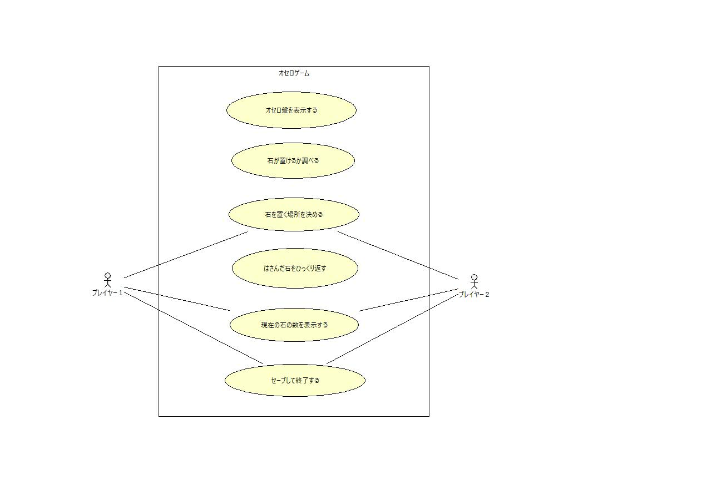
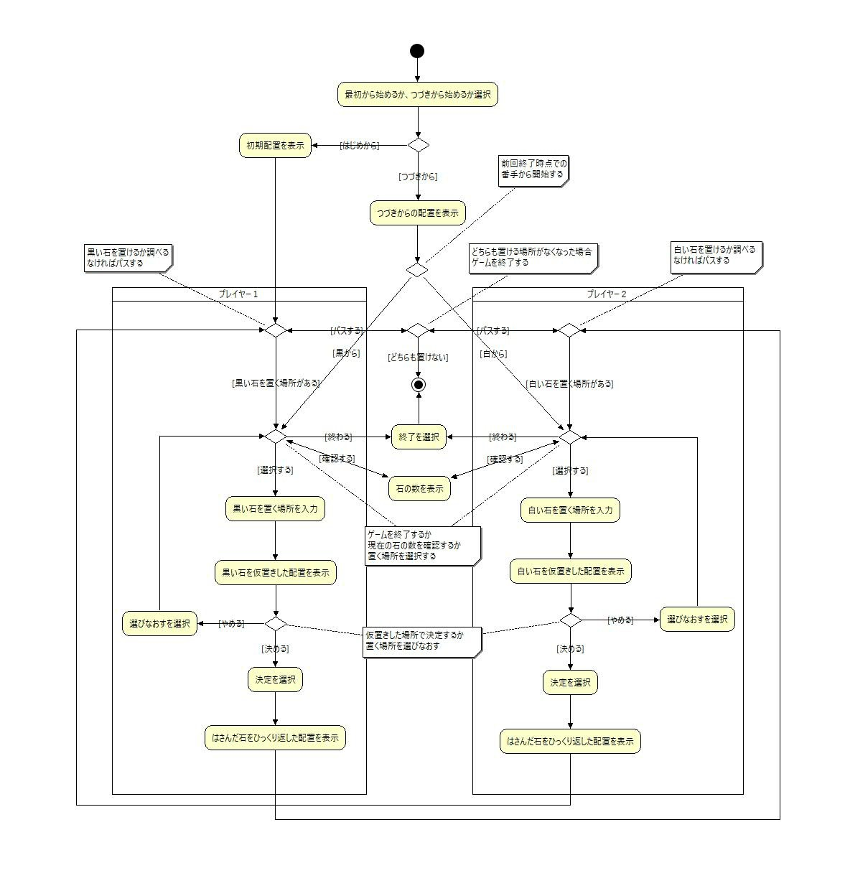

# OJT課題「オセロゲーム」 機能仕様書

***
## 目次
- [はじめに](#はじめに)
  - [本書の目的](#本書の目的)
  - [本書の記述内容](#本書の記述内容)
- [機能仕様/ユースケース仕様](#機能仕様/ユースケース仕様)
  - [ユースケース図](#ユースケース図)
  - [アクティビティ図](#アクティビティ図)
  - [title2-3](#title2-3)
- [メッセージ定義](#メッセージ定義)
- [未決定事項](#未決定事項)

***
## はじめに
### 本書の目的
　オセロゲームが提供すべき機能をどのように実現するのかを利用者の視点で明確にする事。

### 本書の記述内容
　本書はユースケースを用いてオセロゲームの機能仕様を定義する。  
「機能仕様/ユースケース仕様」で、ユースケースの詳細レベルの仕様を定義する。  
「メッセージ定義」で画面に表示される各メッセージを定義する。  
「未決定事項」で未決定としていることを明確にする。  

***
## 機能仕様/ユースケース仕様
### ユースケース図

### アクティビティ図

### title2-3

***
## メッセージ定義
 __処理メッセージ__ 
|ID|メッセージ内容|対応画面|
|:----|:----|:----|
|PM01| | |
|PM02| | |
|PM03| | |

 __エラーメッセージ__ 
|ID|メッセージ内容|対応画面|
|:----|:----|:----|
|EM01| | |
|EM02| | |
|EM03| | |

***
## 未決定事項
特になし。
