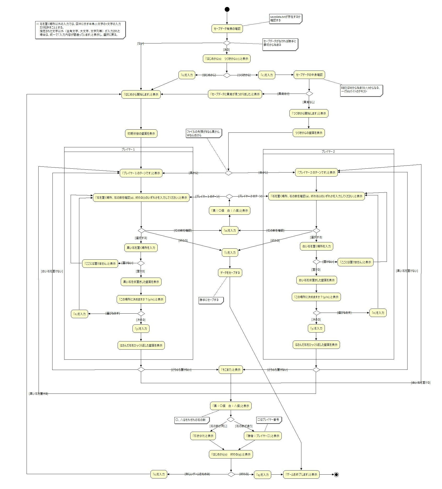

# OJT課題「オセロゲーム」 機能仕様書

## 変更履歴
|日付|版|説明|作成者/変更者|
|:---|:---|:---|:---|
|2022/11/11|1.0|初版|後藤政允|
|2022/11/15|1.1|1回目レビュー後|後藤政允|
|2022/11/16|1.2|2回目レビュー後|後藤政允|
|2022/12/23|1.3|テスト仕様書1回目レビュー後|後藤政允|

## 目次
- [はじめに](#はじめに)
  - [本書の目的](#本書の目的)
  - [本書の記述内容](#本書の記述内容)
- [機能仕様](#機能仕様)
  - [ユースケース図](#ユースケース図)
  - [アクティビティ図](#アクティビティ図)
  - [コンソール入力の仕様](#コンソール入力の仕様)
  - [石を置く場所の指定方法](#石を置く場所の指定方法)
  - [セーブ用ファイルの仕様](#セーブ用ファイルの仕様)
  - [機能詳細](#機能詳細)
    - [はじめから始めるか、つづきから始めるか決める](#はじめから始めるか、つづきから始めるか決める)
    - [オセロ盤を表示する](#オセロ盤を表示する)
    - [石が置けるか調べる](#石が置けるか調べる)
    - [石を置く場所を決める](#石を置く場所を決める)
    - [はさんだ石をひっくり返す](#はさんだ石をひっくり返す)
    - [現在の石の数を表示する](#現在の石の数を表示する)
    - [セーブして終了する](#セーブして終了する)
    - [もう一度はじめから始めるか、終わるか決める](#もう一度はじめから始めるか、終わるか決める)
- [未決定事項](#未決定事項)

## はじめに
### 本書の目的
　オセロゲームが提供すべき機能をどのように実現するのかをプレイヤーの視点で明確にする事。

### 本書の記述内容
　本書はオセロゲームの機能仕様を定義する。  
「機能仕様」で、詳細レベルの仕様を定義する。    
「未決定事項」で未決定としていることを明確にする。  

## 機能仕様
### ユースケース図

### アクティビティ図

### コンソール入力の仕様
　本ゲーム内のコンソール入力は必ず半角入力で行うものとし、全角入力した場合の動作は保証しない。

### 石を置く場所の指定方法
  
　本ゲームでは上図のように、オセロ盤の行を1～8の数字、列をA～Hのアルファベットで示す。  
したがって、石を置く場所を入力する場合は、このアルファベットと数字を1つずつ用いて盤上の位置を表すこととする。  
なお、 アルファベットと数字は、ともに半角文字で入力しなければならない。  
上図で例えると、白い石がある位置はD4とE5、黒い石がある位置はD5とE4と表せる。  

### セーブ用ファイルの仕様
* ゲームデータのセーブ用ファイルの名前は「savedata.txt」とする。  
* ファイルの中身は、65バイトの文字列である。  
* ファイルの先頭1バイトは、黒の手番でセーブした場合は「B」、白の手番でセーブした場合は「W」とする。  
* 2バイト目以降は、オセロ盤のA1～H8 までに対応した64バイトの文字列とし、白を「0」、黒を「1」、空を「9」で表す。  
* ファイルの中身が下記のような状態にある場合、データは正常ではないと判断する。
  * サイズが66バイト以上である。
  * 先頭1バイトが「B」または「W」以外の文字である。
  * 2バイト目以降に「0」、「1」、「9」以外の文字が含まれている。
  * 盤上に全て石が置かれている。
  * 盤上に石が一つも置かれていない。
  * 盤上に黒、または白の石しか置かれていない。

### 機能詳細
#### はじめから始めるか、つづきから始めるか決める
* アクター：プレイヤー、システム
* トリガー：システム起動
* 概要：ゲームをはじめから始めるか、つづきから始めるか決める。
* 基本フロー：
  1. システムを起動する。
  2. 「はじめから開始します」と表示される。
* 代替フロー1：セーブデータが有り、はじめから始める場合
  1. システムを起動する。
  2. 「はじめから(s)　つづきから(c)」と表示される。
  3. 「s」を入力する。
  4. 「はじめから開始します」と表示される。
* 代替フロー2：セーブデータが有り、はじめから始める場合
  1. システムを起動する。
  2. 「はじめから(s)　つづきから(c)」と表示される。
  3. 「c」を入力する。
  4. 「つづきから開始します」と表示される。
* 例外フロー1：セーブデータに異常がある場合
  1. システムを起動する。
  2. 「はじめから(s)　つづきから(c)」と表示される。
  3. 「c」を入力する。
  4. 「セーブデータに異常が見つかりました」と表示される。
  5. 「つづきから開始します」と表示される。
* 例外フロー2：指定された文字以外が入力された場合
  1. システムを起動する。
  2. 「はじめから(s)　つづきから(c)」と表示される。
  3. 指定された文字以外を入力する。
  4. 「入力内容が間違っています」と表示される。

#### オセロ盤を表示する
* アクター：システム
* トリガー：ゲームの開始、石を置く場所の選択・決定
* 概要：オセロ盤を表示する。
* 基本フロー：
  1. はじめからゲームを開始する。
  2. 初期状態のオセロ盤が表示される。
* 代替フロー1：つづきから始めた場合
  1. つづきからゲームを開始する。
  2. 前回終了時のオセロ盤が表示される。
* 代替フロー2：石を置く場所が選択された場合
  1. 石を置く場所を選択する。
  2. 石を仮置きした状態のオセロ盤が表示される。
* 代替フロー3：石を置く場所が決定された場合
  1. 石を置く場所を決定する。
  2. はさんだ石をひっくり返した状態のオセロ盤が表示される。
* 例外フロー：なし

#### 石を置ける場所を調べる
* アクター：システム
* トリガー：自分のターンの終了
* 概要：石を置ける場所を調べる。
* 基本フロー：
  1. 自分のターンが終わる。
  2. 対戦相手が石を置ける場所を調べる。
  3. 対戦相手のターンに移る。
* 代替フロー1：対戦相手が石を置ける場所がない場合
  1. 自分のターンが終わる。
  2. 対戦相手が石を置ける場所を調べる。
  3. 自分のターンに移る。
* 代替フロー2：どちらも石を置けない場合
  1. 「そこまで」と表示される。
  2. 「勝者：プレイヤー□」と表示される。（同数の場合は「引き分け」と表示される。）
* 例外フロー：なし

#### 石を置く場所を決める
* アクター：プレイヤー
* トリガー：選択メッセージの表示
* 概要：プレイヤーが次に石を置く場所を選択・決定する。
* 基本フロー：
  1. 次に石を置く場所を入力する。
  2. 「この場所に決めますか？(y/n)」とコンソールに表示される。
  3. 「y」を入力する。
* 代替フロー：置く場所を選択しなおす場合
  1. 次に石を置く場所を入力する。
  2. 「この場所に決めますか？(y/n)」とコンソールに表示される。
  3. 「n」を入力する。
* 例外フロー1：石を置くことができない場所を選択した場合
  1. 次に石を置く場所を入力する。
  2. 「ここには置けません」と表示される。
* 例外フロー2：指定された文字以外が入力された場合
  1. 指定された文字以外を入力する。
  2. 「入力内容が間違っています」と表示される。

#### はさんだ石をひっくり返す
* アクター：システム
* トリガー：石を置く場所の決定
* 概要：置いた石ではさんだ対戦相手の石をひっくり返す。
* 基本フロー：
  1. 石を置く場所を決める。
  2. 置いた石ではさんだ対戦相手の石を自分の石に変える。
* 代替フロー：なし
* 例外フロー：なし

#### 現在の石の数を表示する
* アクター：プレイヤー
* トリガー：石の数の確認を選択、どちらも石を置けない状態
* 概要：現在の両プレイヤーの石の数を表示する。
* 基本フロー：
  1. 「a」を入力する。
  2. 現在の石の数が「黒：〇個　白：△個」と表示される。
* 代替フロー：どちらも石を置けない場合
  1. 現在の石の数が「黒：〇個　白：△個」と表示される。
* 例外フロー：指定された文字以外が入力された場合
  1. 指定された文字以外を入力する。
  2. 「入力内容が間違っています」と表示される。

#### セーブして終了する
* アクター：プレイヤー
* トリガー：セーブして終了を選択
* 概要：遊戯中のゲームをセーブして終了する。
* 基本フロー：
  1. 「i」を入力する。
  2. 現在のオセロ盤の状況がセーブされる。
  3.「ゲームを終了します」と表示。
  4. ゲームが終わる。
* 代替フロー：なし
* 例外フロー：指定された文字以外が入力された場合
  1. 指定された文字以外を入力する。
  2. 「入力内容が間違っています」と表示される。

#### もう一度はじめから始めるか、終わるか決める
* アクター：プレイヤー
* トリガー：ゲームの決着
* 概要：決着がついた後、もう一度はじめから始めるか、終わるか決める。
* 基本フロー：
  1. ゲームの決着がつく。
  2. 「はじめから(s)　終わる(q)」と表示される。
  3. 「s」を入力する。
  4. 「はじめから開始します」と表示される。
* 代替フロー：終わる場合
  1. ゲームの決着がつく。
  2. 「はじめから(s)　終わる(q)」と表示される。
  3. 「q」を入力する。
  4. 「ゲームを終了します」と表示される。
  5. ゲームが終わる。
* 例外フロー：指定された文字以外が入力された場合
  1. 指定された文字以外を入力する。
  2. 「入力内容が間違っています」と表示される。

## 未決定事項
特になし。
