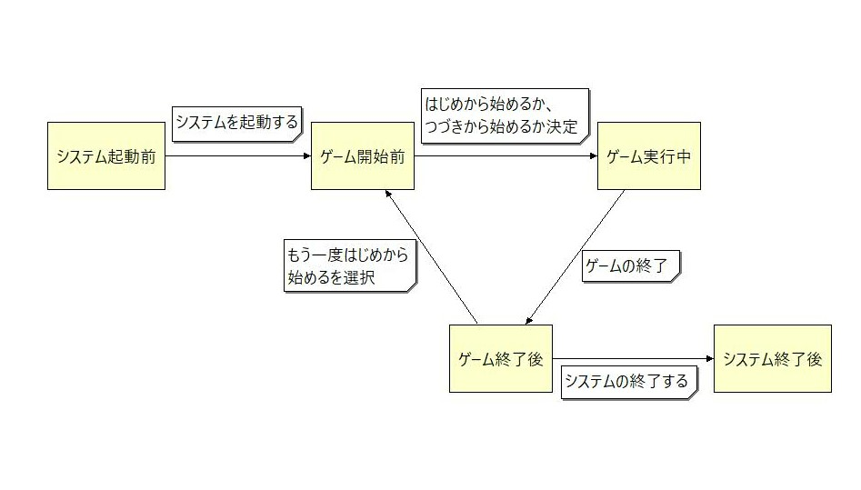

# OJT課題「オセロゲーム」 詳細設計書

## 変更履歴
|日付|版|説明|作成者/変更者|
|:---|:---|:---|:---|
|2022/11/30|1.0|初版|後藤政允|

## 目次
- [はじめに](#はじめに)
  - [本書の目的](#本書の目的)
  - [本書の記述内容](#本書の記述内容)
- [詳細設計仕様](#詳細設計仕様)
  - [状態遷移図](#状態遷移図)
  - [シーケンス図](#シーケンス図)
- [関数定義](#関数定義)
  - [define定義](#define定義)
  - [グローバル変数定義](#グローバル変数定義)
  - [内部関数定義](#内部関数定義)
- [未決定事項](#未決定事項)

## はじめに
### 本書の目的
　要件をどこでどのように実現するかを明確にし、システム及びソフトウェアの方式を設計する事。

### 本書の記述内容
「詳細設計仕様」で、ファイルの構成と各関数の関係性を明らかにする。  
「関数定義」で、関数仕様の詳細を明らかにする。  
「未決定事項」で、未決定としていることを明確にする。  

## 詳細設計仕様
* othello.c：メイン関数と、処理の流れを示す関数を扱うファイル。
* model.c：内部的な処理をする関数を扱うファイル。
* view.c：コンソール表示をする関数を扱うファイル。
* file.c：ファイル操作にかかわる関数を扱うファイル。

### 状態遷移図

### シーケンス図
#### ゲーム開始前

#### ゲーム実行中

#### ゲーム終了後

## 関数定義
### define定義
* システム終了  
SYSTEM_END　0
* 真偽の定数  
FUNCTION_FALSE　0  
FUNCTION_TRUE　 1
* オセロ盤を表示する際必要な行数  
LINE_NUM　17
* セーブデータのサイズ  
SAVEDATA_SIZE　65
* メッセージの種類  
INPUT_ERROR　　　　　　　0  
BIGINNING_OR_CONTINUE　 1  
BIGINNING_START　　　　　2  
CONTINUE_START　　　　　 3  
SAVADATA_ABNORMAL　　   4  
TURN_PLAYER1　　　　　　 5  
TURN_PLAYER2　　　　　　 6  
PLACE_OR_AFFIR_OR_INT　　7  
CANT_PUT　　　　　　　    8  
PLACE_DICIDE　　　　　　  9  
GAME_SET　　　　　　　   10  
GAME_DRAW　　　　　　   11  
WIN_PLAYER1　　　　　　 12  
WIN_PLAYER2　　　　　　 13  
BIGINNING_OR_QUIET　　  14  
GAME_END　　　　　　　 15  
* 八方向  
UPPER_LEFT　　-9  
ABOVE　　　　-8  
UPPER_RIGHT　-7  
LEFT　　　　　-1  
RIGHT　　　　  1  
LOWER_LEFT　     7  
UNDER　　　　8  
LOWER_RIGHT　9  
* 石  
OTHELLO_WHITE　'0'  
OTHELLO_BLACK　'1'  
OTHELLO_BLANK　'9'
* 手番  
TURN_BLACK　'B'  
TURN_WHITE　'W'
* ファイル名  
FILE_NAME　"savedata.txt"
* 初期盤面を表すデータ  
INITIAL_PLACEMENT　"B9999999999999999999999999990199999910999999999999999999999999999"
* オセロ盤の枠  
BOARD_FRAME　"+---+---+---+---+---+---+---+---+\n"

### グローバル変数定義
* board
  |型|要素数|概要|
  |:---|:---|:---|
  |char[]|SAVEDATA_SIZE＋1|・オセロ盤を表す配列。 ・初期値はINITIAL_PLACEMENT。|

### 内部関数定義
- othello.c
  - main()  
    * 書式
      ||型|変数名|概要|
      |:---|:---|:---|:---|
      |引数|-|-|-|
      |戻り値|int|-|-|
    * 仕様説明  
      オセロゲームを実行する、メイン関数。

  - opening_game()
    * 書式
      ||型|変数名|概要|
      |:---|:---|:---|:---|
      |引数|-|-|-|
      |戻り値|void|-|-|
    * 仕様説明  
      システム起動からゲーム開始までの処理の流れ。  
      ゲームをはじめから開始するか、つづきから開始するか決める。

  - playing_game()
    * 書式
      ||型|変数名|概要|
      |:---|:---|:---|:---|
      |引数|-|-|-|
      |戻り値|int|-|TRUE、またはFALSE。|
    * 仕様説明  
      ゲーム開始から終了するまでの処理の流れ。  
      プレイヤーの入力を元に、ゲームを進行する。  
      ゲームに決着がついて終了した場合はTRUE、途中で終了した場合はFALSEを返す。
    
  - closing_game()
    * 書式
      ||型|変数名|概要|
      |:---|:---|:---|:---|
      |引数|int|how_to_end|TRUE、またはFALSE。|
      |戻り値|void|-|-|
    * 仕様説明  
      ゲーム終了からシステム終了までの処理の流れ。  
      決着がついて終了した場合はTRUE、途中で終了した場合はFALSEを引数で受け取る。  
      TRUEの場合、ゲームの勝敗を決め、もう一度はじめから始めるか、システムを終了するか決める。  
      FALSEの場合、システムを終了する。

- model.c
  - check_line_stone_place()
    * 書式
      ||型|変数名|概要|
      |:---|:---|:---|:---|
      |引数1|int|direction|置ける場所を調べる方向。|
      |引数2|int|element_num|調べる起点となる要素番号。|
      |戻り値|int|-|TRUE、またはFALSE。|
    * 仕様説明  
      引数2の場所から見て引数1の方向に石を置ける場所があるかどうかを確認する。  
      ある場合は、戻り値でその場所の要素番号を返す。  
      ない場合はFUNCTION_FALSEを返す。

   - check_stone_place()
    * 書式
      ||型|変数名|概要|
      |:---|:---|:---|:---|
      |引数|int*|possible_place|石を置ける場所の要素番号の配列。|
      |戻り値|int|-|TRUE、またはFALSE。|
    * 仕様説明  
      全マスにおいて、八方向分check_line_stone_place()を呼び出し、石を置ける場所を引数に追加していく。

  - turn_over_line_stone()
    * 書式
      ||型|変数名|概要|
      |:---|:---|:---|:---|
      |引数1|int|direction|ひっくり返す石があるか調べる方向。|
      |引数2|int|element_num|置く場所の要素番号。|
      |戻り値|void|-|-|
    * 仕様説明  
      引数2の場所から見て引数1の方向にひっくり返す石があるかどうかを確認する。  
      あった場合、はさんだ石の要素をBLACK_STONEならWHITE_STONEに、WHITE_STONEならBLACK_STONEにする。

  - turn_over_stone()
    * 書式
      ||型|変数名|概要|
      |:---|:---|:---|:---|
      |引数|int|decide_place|石を置いた場所の要素番号。|
      |戻り値|void|-|-|
    * 仕様説明  
      引数の場所から八方向分turn_over_line_stone()を呼び出す。

  - check_stone_input()
    * 書式
      ||型|変数名|概要|
      |:---|:---|:---|:---|
      |引数|char*|input|石を置く場所の入力内容。|
      |戻り値|int|element_num|その場所の要素番号、またはFALSE。|
    * 仕様説明  
      石を置く場所の入力が仕様と一致しているか確認する。  
      入力が正しい場合はその場所の要素番号、正しくない場合はFALSEを返す。

  - get_stone_num()
    * 書式
      ||型|変数名|概要|
      |:---|:---|:---|:---|
      |引数|char|stone_type|BLACK_STONE、またはWHITE_STONE|
      |戻り値|int|cnt|盤上の石の数。|
    * 仕様説明  
      黒と白どちらの石かの情報を引数から受け取り、盤上にあるそれらの石の数を戻り値で返す。

- view.c
  - show_board()
    * 書式
      ||型|変数名|概要|
      |:---|:---|:---|:---|
      |引数|-|-|-|
      |戻り値|void|-|-|
    * 仕様説明  
      現在のオセロ盤の状態をコンソール上に表示する。

    - show_message()
    * 書式
      ||型|変数名|概要|
      |:---|:---|:---|:---|
      |引数|int|message_num|メッセージの種類を指す番号。|
      |戻り値|void|-|-|
    * 仕様説明  
      引数に対応したメッセージをコンソール上に表示する。

    - show_stone_num()
    * 書式
      ||型|変数名|概要|
      |:---|:---|:---|:---|
      |引数1|int|black_num|盤上の黒い石の数。|
      |引数2|int|white_num|盤上の白い石の数。|
      |戻り値|void|-|-|
    * 仕様説明  
      現在の各プレイヤーの石の数をコンソール上に表示する。

- file.c
  - file_existence()：
    * 書式
      ||型|変数名|概要|
      |:---|:---|:---|:---|
      |引数|-|-|-|
      |戻り値|int|-|TRUE、またはFALSE。|
    * 仕様説明  
      ファイル名がFILE_NAMEのファイルが存在するか確認する。  
      存在する場合はTRUE、ない場合はFALSEを返す。  
  
  - file_content()：
    * 書式
      ||型|変数名|概要|
      |:---|:---|:---|:---|
      |引数|-|-|-|
      |戻り値|int|-|TRUE、またはFALSE。|
    * 仕様説明  
      ファイルの中身がセーブデータ仕様に沿ったものになっているか確認する。  
      なっていればTRUE、なっていなければFALSEを返す。  
  
  - data_save()
    * 書式
      ||型|変数名|概要|
      |:---|:---|:---|:---|
      |引数|-|-|-|
      |戻り値|void|-|-|
    * 仕様説明  
      変数boardの内容を、ファイル名がFILE_NAMEのファイルへ書き込む。  
      ファイルがない場合は新規作成し、ある場合は上書きする。  

  - file_delete()
    * 書式
      ||型|変数名|概要|
      |:---|:---|:---|:---|
      |引数|-|-|-|
      |戻り値|void|-|-|
    * 仕様説明  
      ファイル名がFILE_NAMEのファイルを削除する。

## 未決定事項
特になし。
